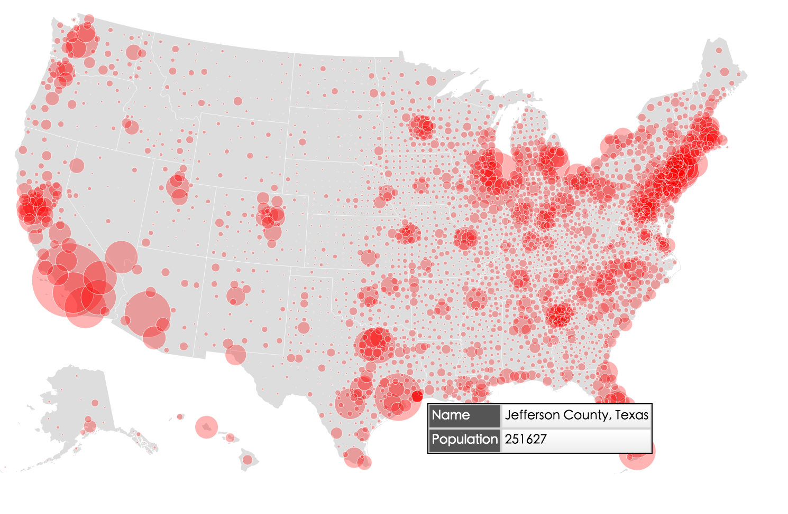
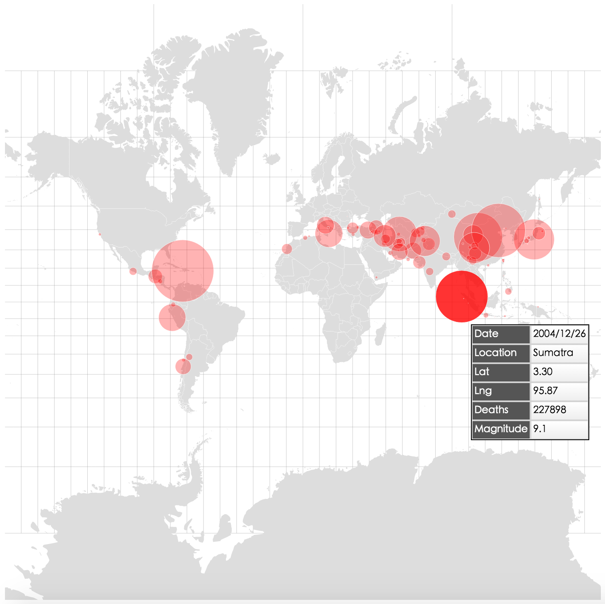
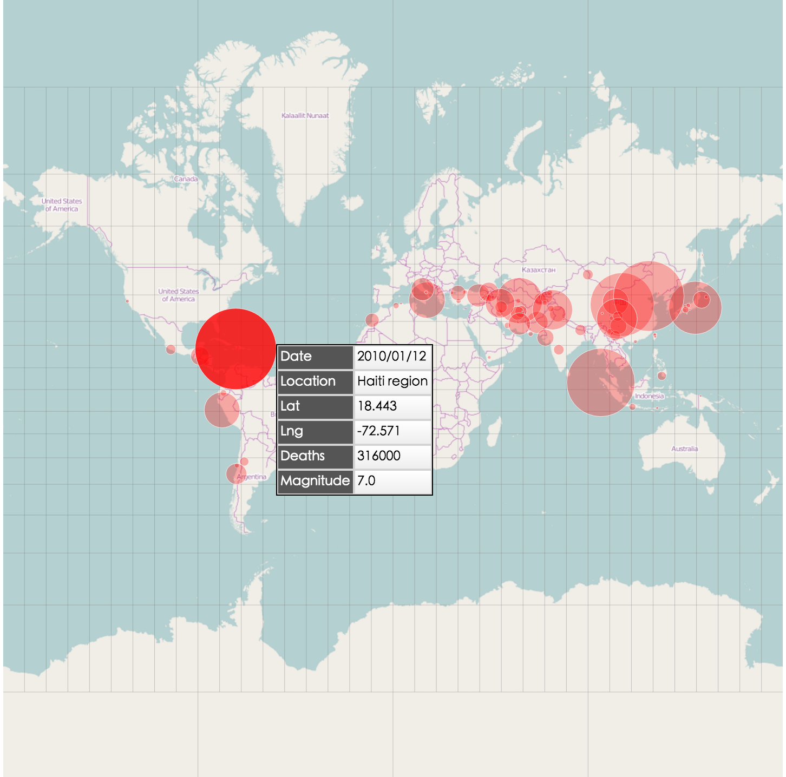

# react-d3-map-bubble

react-d3-map bubble

## Example 1

Reference: http://bl.ocks.org/mbostock/9943478

```js
"use strict";

var React = require('react');
var ReactDOM = require('react-dom');
var topojson = require('topojson');
var MapBubble = require('../../lib').MapBubble;

var css= require('./css/bubble.css');

// Example
(function() {
  var width = 960,
  height = 600;

  var us = require('json!../data/us.json');

  // data should be a MultiLineString
  var dataStates = topojson.mesh(us, us.objects.states, function(a, b) { return a !== b; });
  /// data should be polygon
  var dataCounties = topojson.feature(us, us.objects.nation);

  // class
  var meshClass = 'border';
  var polygonClass = 'land';

  // domain
  var domain = {
    scale: 'sqrt',
    domain: [0, 1e6],
    range: [0, 15]
  };

  var circles = topojson.feature(us, us.objects.counties).features
      .sort(function(a, b) { return b.properties.population - a.properties.population; })
  var circleValue = function(d) { return +d.properties.population; };
  var projection = 'null';

  var tooltipContent = function(d) {return d.properties;}

  ReactDOM.render(
    <MapBubble
      width= {width}
      height= {height}
      dataPolygon= {dataCounties}
      polygonClass= {polygonClass}
      dataMesh= {dataStates}
      meshClass = {meshClass}
      domain= {domain}
      dataCircle= {circles}
      circleValue= {circleValue}
      circleClass= {'bubble'}
      projection= {projection}
      tooltipContent= {tooltipContent}
      showGraticule= {false}
      showTooltip= {true}
      showLegend= {true}
    />
  , document.getElementById('blank-mapbubble')
  )

})()

```



## Example 2 (Global earthquake)

```js
"use strict";

var React = require('react');
var ReactDOM = require('react-dom');
var topojson = require('topojson');
var MapBubble = require('../../lib').MapBubble;

var css= require('./css/bubble.css');

// Example
// http://bl.ocks.org/mbostock/4060606
(function() {
  var width = 960,
  height = 960;

  var world = require('json!../data/world-50m.json');
  var earthquake = require('json!../data/earthquake.json');

  // data should be a MultiLineString
  var countries = topojson.mesh(world, world.objects.countries, function(a, b) { return a !== b; });
  /// data should be polygon
  var land = topojson.feature(world, world.objects.land);

  // class
  var meshClass = 'border';
  var polygonClass = 'land';

  // domain
  var domain = {
    scale: 'sqrt',
    domain: d3.extent(earthquake, function(d) {return +d.deaths}),
    range: [0, 50]
  };

  var circles = earthquake
  var circleValue = function(d) { return +d.deaths; };

  var circleX = function(d) {return +d.lng};
  var circleY = function(d) {return +d.lat};

  var tooltipContent = function(d) {
    delete d.cell;
    delete d.comments;
    return d;
  }

  var scale = (width + 1) / 2 / Math.PI;
  var translate = [width / 2, height / 2];
  var precision = .1;
  var projection = 'mercator';

  ReactDOM.render(
    <MapBubble
      width= {width}
      height= {height}
      dataPolygon= {land}
      polygonClass= {polygonClass}
      dataMesh= {countries}
      meshClass = {meshClass}
      domain= {domain}
      dataCircle= {circles}
      circleValue= {circleValue}
      circleClass= {'bubble'}
      circleX= {circleX}
      circleY= {circleY}
      tooltipContent= {tooltipContent}
      projection= {projection}
      precision= {precision}
      translate= {translate}
      scale= {scale}
      showGraticule= {true}
      showTooltip= {true}
      showLegend= {false}
    />
  , document.getElementById('blank-earthquake')
  )

})()
```



### With tile



## Install

```
npm install --save react-d3-map-bubble
```

## License

Apache 2.0
